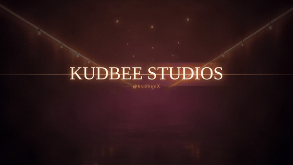
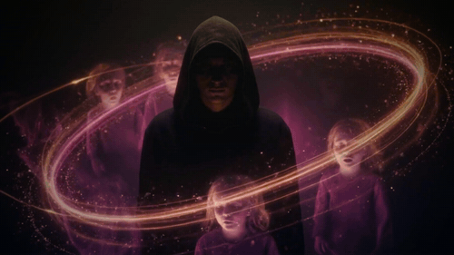
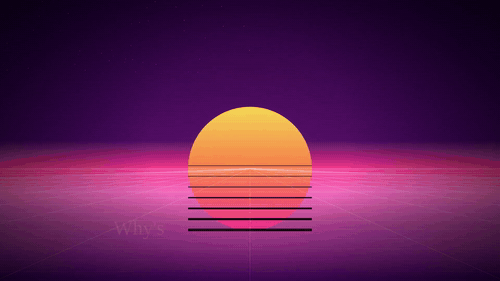

<div align="center">

# 🧠 HERMES

### A local, deterministic **songwriting brain** — write original songs *and see exactly how it thought*. No API key. Runs in your browser.

A roster of specialized agents that cross-check each other. **$0. No paid services. No GPU. Same input → same song, on every machine.**

[](https://github.com/KudbeeZero/kudbee-music/actions/workflows/ci.yml)
[](LICENSE)
[](https://nodejs.org)
[](CONTRIBUTING.md)

[**🌐 Try it live — no install**](https://wifi-dj-meme.pages.dev) · [**⚡ Try it in 10 seconds**](#-try-it-in-10-seconds) · [**🧠 See the brain think**](examples/demos/) · [Semantic memory](#-semantic-memory-opt-in) · [The brain](#-the-brain-two-hemispheres-one-dial) · [Docs](docs/) · [Roadmap](#-roadmap)

</div>

---

## ⚡ Try it in 10 seconds

**Zero install:** the app is live at **[wifi-dj-meme.pages.dev](https://wifi-dj-meme.pages.dev)** — the landing walks you into the Hit Factory, entirely in your browser, no key. Or run it locally:

```bash
git clone https://github.com/KudbeeZero/kudbee-music && cd kudbee-music
npm install
npm run demo        # generates a full original song + prints what each brain region did
```

No key, no signup, no network — it runs the real pipeline locally and prints the lyrics,
the scores, and a **per-region trace of how the brain made its choices**. Then open the web
app for the full deck:

```bash
npm run web:dev     # → http://localhost:3000/hermes
```

**Prefer to just look?** Every demo song ships with its generation trace:
**[▶ browse the demo gallery](examples/demos/)** — each one has a brain heat-map, a card for
what every region contributed, and a copy-paste Suno prompt. Inside the app, the **"🔍 Explain
this song"** button opens that same interactive trace for anything you make.

---

**HERMES is a roster of specialized agents that cross-check each other to write original songs — from a rough idea to a complete package (concept · hooks · lyrics · production · Suno prompts · scores), entirely from code, for free.** The lyrical process *and the brain that runs it* are the point; it also **renders music videos** from the same brain (see [Video Studio](#-studio-1--the-video-studio)). Two studios, one brain:

| | 🎤 **Hit Factory** *(the song brain — start here)* | 🎬 **Video Studio** |
|---|---|---|
| **Does** | a rough idea → a complete, original **song package** | song + clips → a vocal-synced **1080p music video** |
| **How** | 10 cross-checking agents, local "Lyrical Combinator" | headless Chromium frames → ffmpeg, forced-aligned lyrics |
| **Run** | `npm run web:dev` → `/hermes` (web app) | `hermes build` (CLI) |
| **Out** | concept, hooks, lyrics, production, visuals, **Suno prompts**, scores | `out/*.mp4` |
| **Cost** | $0 — fully local/mock, **no API key** | $0 — ffmpeg + Chromium |

The song brain writes deterministic, original-only lyrics, scores them, checks them for
originality, and **shows its reasoning** — then hands you Suno-ready prompts. The video
studio is the downstream half: the flagship demo is a finished 2:38 video for *"Stay There ×
Fuck Em × Poverty Porn"* by **Dom Shady / kudbee** — cinematic neo-noir, forced-aligned
lyrics, 25 hero shots cut to the beat.

<div align="center">
 

[**▶ Watch the full demo video**](media/kudbee-music-video-1080p.mp4)
</div>

> **🔗 The full loop.** Write a song in the **Hit Factory** → it hands you Suno-ready prompts → render the audio in Suno → `hermes from-song song.json` scaffolds a **video project** with your lyrics already in place → drop the audio → `hermes build` → a finished **music video**. Both halves of HERMES, one pipeline.

---

## 🧠 The brain: two hemispheres, one dial

HERMES isn't just a pipeline — it's a **brain**. The agents split into a **right hemisphere** that *creates* (generative, divergent) and a **left hemisphere** that *verifies* (analytical, convergent). Lateralization is a **bias, not a switch** — both always run — so a single dial leans the whole studio one way.

> **Right proposes; left disposes.**

| Right — *generative* | Left — *analytical* |
|----------------------|---------------------|
| director · songwriter · lyricist · art · composer · **Hooksmith · Lyric Chemist · Visual Director** | analyst · editor · producer · render · qa · **A&R Judge · Originality Auditor · Beat Oracle** |

In the **video studio** the dial is `--brain right\|left\|balanced` — on the flagship song, *left → 57 short legible cuts, right → 41 that breathe*, same song, different temperament. In the **Hit Factory** the same split is "the artist writes, the analyst scores." The hemispheres never share state — they pass **artifacts** across a *corpus callosum*. Full write-up: [`brain/hemispheres.md`](brain/hemispheres.md) · machine-readable [`brain/brain.json`](brain/brain.json).

The brain also has a **memory layer** ([`brain/memory.json`](brain/memory.json)) — it remembers your preferences and a growing exclusion list, and **learns who you are** from everything you make.

> **ℹ️ On the brain language.** The hemispheres, the ~11 named "regions," and the
> "nervous system" are an **inspired conceptual model** — a workflow architecture for
> balancing *generation* against *critique*, borrowed from how a creative brain
> lateralizes. It is **not a claim of biological fidelity** and does not simulate
> neurons. Under the metaphor it's a deterministic multi-agent system plus a memory
> layer (working memory that decays and consolidates into long-term on save). The
> metaphor is the map; the code is the territory — and it's all readable in `lib/hermes/`.

---

## 🧠 Semantic memory (opt-in)

The brain can **recall past work by *meaning*, not just keywords** — an optional local layer
that never touches the network or a paid API. When you install the on-device embedding model
(`npm i @xenova/transformers`), every finished song is stored across four lenses and each
agent can recall by its own:

| Lens | Question it answers | Feeds |
|------|--------------------|-------|
| **procedural** | "have I crafted *this theme* before?" | procedural memory |
| **emotion** | "have I chased *this feeling* before?" | the limbic layer |
| **hook** | "have I written *a hook like this* before?" | the Council (self-repetition) |
| **lyric** | "is this line *too close in meaning* to a past one?" | originality scoring |

Retrieval is **deterministic** (a quantized similarity key + stable tie-breaks, so results
can't reorder across Intel / Apple Silicon / AMD) and supports **hybrid search** (blend
semantic similarity with keyword overlap) and **MMR diversity** (don't surface three
near-identical memories) — all opt-in and off by default. Zero embeddings? The whole thing
is a graceful no-op and the rule-based brain runs exactly as before. See
[`lib/hermes/vectorMemory.ts`](lib/hermes/vectorMemory.ts) + [`ARCHITECTURE.md`](ARCHITECTURE.md).

---

## 🎤 Studio 2 — Hit Factory (the song brain)

Type a rough idea — *"Chicago pain song for my daughter, melodic hook, street but emotional, 808 trap, not corny"* — and **10 specialized agents** turn it into a complete, original song package. **Fully local, no API key, no copyrighted material.**

```bash
npm install
npm run web:dev          # http://localhost:3000/hermes  (or /hit-factory)
```

> **No setup? Click _"▶ See a finished example — Cold Hard Gold"_** on the empty
> deck to load a real, 99/100 package (hooks, lyrics, production, scores) the engine
> actually produced — then run it through the video studio with one command. See
> [`examples/cold-hard-gold/`](examples/cold-hard-gold/).

> **Originality & safety.** Lyrics are generated **locally from your own inputs** as a
> creative starting point. HERMES runs a local uniqueness check + a **famous-phrase
> filter**, but does **not** guarantee originality — you're responsible for clearing any
> song before you release or monetize it. Influences are *felt, never copied*; no
> living-artist mimicry.

### 🧾 Proof: five songs, and what the brain thought
Description is cheap; here's the receipts. **[`examples/demos/`](examples/demos/)** holds
five original songs across five genres — each **minted by the real pipeline** (deterministic
seed) with a **generation trace** showing *what every one of the 11 brain regions actually
contributed*: the limbic layer's emotional read, the reward circuit's crave score, the rhyme
scheme + density, the originality check, the A&R verdict. Reproduce them yourself with
`GEN_DEMOS=1 npx vitest run trace`.

| Song | Genre | Score | Lead hook |
|------|-------|-------|-----------|
| [Paper Crowns](examples/demos/paper-crowns/trace.md) | drill trap | 98 | *"This one's for the games that raised me"* |
| [Signal Fade](examples/demos/signal-fade/trace.md) | synthwave pop | 98 | *"Still standing where the loving used to be"* |
| [Concrete Garden](examples/demos/concrete-garden/trace.md) | boom-bap | 97 | *"Still standing where the growing used to be"* |
| [Hometown Ghosts](examples/demos/hometown-ghosts/trace.md) | folk-rap | 93 | *"Tell people I made it out the back"* |
| [Midnight Shift](examples/demos/midnight-shift/trace.md) | lo-fi soul | 92 | *"Every step a promise that I rebuild"* |

**The 10 agents (right proposes, left disposes):**

| Right | Left |
|-------|------|
| **HERMES Conductor** → creative brief | **Beat Oracle** → production notes |
| **Hooksmith** → 3–5 hook options | **Emotion Scanner** → emotional-arc clarity |
| **Lyric Chemist** → verses + final lyrics | **Originality Auditor** → uniqueness 0–100 |
| **Visual Director** → album cover + 16:9 video prompts | **A&R Judge** → banger score 0–100 |
| **Viral Clip Scout** → short-form moments | **Rights & Release Guard** → release checklist |

**It doesn't just generate — it learns you and recommends:**

- 🧠 **Memory** — a growing **exclusion list** + preferences that stick without re-specifying (`brain/memory.json`). Warn-only — it never blocks generation.
- 📈 **Learning** — builds an evolving **artist profile** from your vault (genres, moods, recurring themes, crutch words, dark-lean).
- 💡 **Recommendations** — the emotional contrast to take next, words to retire (one-tap → exclusion), album readiness, weak-hook craft notes, the best-fit production pack.
- 💿 **Albums** — assemble vault tracks into an album; the brain writes the concept, flags the **arc/length gaps**, proposes a running order, and exports **all Suno prompts in one copy-paste block**.
- 🎛️ **Expansion packs** — production/style presets (`drill-dark`, `soul-sample`, `trap-ballad`) each with a ready-to-paste **Suno "Style of Music"** string; the brain recommends the one that fits you and pipes it into a new track.
- 🎚️ **Banger score** — hook strength · emotional clarity · originality · replay value · visual identity · short-form potential · release readiness = **/100**.

Engine is typed (`lib/hermes/`), the UI is a cinematic command deck (`app/hermes`, `components/hermes/`), and everything runs behind **vendor-neutral adapters** so a real AI/music provider drops in later without touching the agents. Full guide: [`docs/hit-factory.md`](docs/hit-factory.md).

---

## 🎬 Studio 1 — the video studio

Turn **a song + a few reference clips** into a real, vocal-synced **1080p music video** — composited frame-by-frame in a headless browser and encoded with ffmpeg.

```bash
node bin/hermes prep        # extract hero-clip frames
node bin/hermes preview     # render a short slice -> out/preview.mp4
node bin/hermes build       # full render -> out/kudbee-music-video-1080p.mp4
```

- **Code, not a timeline editor.** The whole video is a deterministic program — reproducible, diffable, re-renderable.
- **Lyric-accurate.** Whisper word-timestamps are force-aligned to your exact lyrics, so text lands on the vocal (and recovers when ASR struggles on a hook).
- **Project-targeted.** `hermes new mysong` scaffolds a project; `hermes build mysong` renders any song from its own `hermes.json` + `song/` + `assets/`.
- **Aspect ratios.** `--aspect 16:9\|9:16\|1:1\|4:5` for YouTube / Shorts / Reels / TikTok.
- **Mastering.** `hermes master` levels the track to **−14 LUFS** (EBU R128), ffmpeg-only.

```
song + clips
   ├─ hermes-analyst   audio → BPM, beat grid, per-frame loudness   (analyze.mjs)
   ├─ hermes-lyricist  Whisper word-times → force-aligned sync-map   (transcribe.py + align.mjs)
   ├─ hermes-director  reference look → treatment (palette, mood)    (brain/treatment.md)
   ├─ hermes-editor    sections + per-line sub-shots, beat-snapped   (build-timeline.mjs)
   ├─ hermes-art       procedural scenes + hero footage + type       (player.html)
   ├─ hermes-render    headless Chromium → JPEG → ffmpeg (H.264+AAC) (render.mjs)
   └─ hermes-qa        eval gate: dims, not-black, sync, pacing      (qa.mjs)
   ▼  out/*.mp4  (1920×1080, muxed with your audio)
```

### Scene packs
A **scene pack** is a visual style. Switch with `--pack` — the *same song*, a totally different look:

| pack | the look |
|------|----------|
| `neo-noir` *(default)* | cinematic detective film — amber neon, film grain, split-tone |
| `retrowave` | 80s synthwave — chrome sun, neon perspective grid, hot pink/cyan |
| `vhs-lofi` | faded analog tape — teal/cream wash, scanlines, head-switch noise |
| `lyric-minimal` | type-forward — near-black canvas, one warm accent orb, lots of air |

 

**Adding a pack is the best way to contribute** — see [CONTRIBUTING](CONTRIBUTING.md) and the [build-a-pack guide](docs/scene-packs.md).

---

## 🚀 Quickstart

```bash
git clone https://github.com/KudbeeZero/kudbee-music && cd kudbee-music
npm install

# ⚡ See it work in 10 seconds — generate a full song + the brain trace, in your terminal
npm run demo

# 🎤 Song brain (web app — no API key)
npm run web:dev                         # open http://localhost:3000/hermes

# 🎬 Video studio (CLI — needs a static ffmpeg at .bin/ffmpeg, or $FFMPEG/$FFPROBE)
node bin/hermes prep && node bin/hermes build
```

To use your own track in the video studio: drop `song/track.mp3`, your lyrics in `song/lyrics.md`, and reference clips as `assets/hero-clip-NN.mp4`, then `hermes build`. To build your own project: `hermes new <name>` then `hermes build <name>`.

**Want a public link to test the Hit Factory on your phone?** The app is fully static, so it hosts anywhere: **Cloudflare Pages** (`STATIC_EXPORT=1 next build` → `out/`) or **Vercel** (one-click, `vercel.json`) — full steps + custom-domain wiring in [`docs/deploy.md`](docs/deploy.md). Quick local options in [`docs/testing.md`](docs/testing.md).

**Test everything:**
```bash
npm test        # video studio — brain dial + scene-pack contract
npm run test:web   # Hit Factory engine (vitest — 280+ tests)
```

---

## 🗺️ Repository map

```
bin/hermes               video-studio CLI (new, prep, analyze, master, build, render, qa)
studio/                  the video engine (analyze, align, build-timeline, player.html, render, qa, brain)
scene-packs/             visual styles for the video (neo-noir, retrowave, vhs-lofi, lyric-minimal)
brain/                   the shared brain — hemispheres.md, brain.json, memory.json, treatment.md
app/  components/hermes/  the Hit Factory web app (Next.js + React)
lib/hermes/              the Hit Factory engine — agents, pipeline, learn, recommend, album, suno, memory
expansion-packs/         production/style presets for songs (drill-dark, soul-sample, trap-ballad)
docs/                    quickstart, concepts, CLI ref, scene-pack guide, hit-factory guide
.github/workflows/ci.yml  3 gates: check (lint+tests) · smoke (real render + QA) · web (engine tests + build)
```

**New here?** Read [**`ARCHITECTURE.md`**](ARCHITECTURE.md) — the module map, the pipeline
flow, and the non-negotiables — plus the code-generated [brain-wiring diagram](docs/brain-wiring.md).

---

## 🗓️ Roadmap

**Shipped**
- [x] Code-only, vocal-synced 1080p music videos (the flagship)
- [x] Two-hemisphere **brain** + `--brain` dominance dial + `hermes-qa` eval gate (CI-gated)
- [x] 4 **scene packs** · project-targeted builds · 9:16/1:1/4:5 · `−14 LUFS` mastering
- [x] **Hit Factory** — 10-agent song brain, banger score, local uniqueness checker
- [x] **Memory layer** — persistent preferences + growing exclusion list
- [x] **Learning brain** — artist profile + recommendations
- [x] **Albums** + one-click **Suno export** + production **expansion packs**
- [x] **Learn from edits** — rewrite a line, the brain learns your taste
- [x] **Song → video** — `hermes from-song` turns a Hit Factory song into a renderable video project (both studios fused)
- [x] **Public testing URL** — Vercel-ready (`vercel.json`) + deploy guide ([`docs/testing.md`](docs/testing.md))
- [x] **Flagship example + one-click Suno handoff** — load *Cold Hard Gold* in-app; `from-song` emits a ready-to-paste Suno link, and `build` guides you if the audio isn't placed yet
- [x] **11-region brain · 37-subregion Deep Atlas** — hemispheres + intent/values/language/limbic/default-mode/reward/decision + short & long-term memory + nervous system, each region fanning out into anatomy-named subsections (Broca’s & Wernicke’s areas, amygdala, ACC, basal ganglia, VTA…) that each map to a real module (an [inspired workflow model](brain/hemispheres.md), not biological)
- [x] **Honest framing + demo proof** — [5 demo songs with generation traces](examples/demos/) showing what each region contributed
- [x] **Interactive song deck** — selectable hooks (honest re-score + feeds your voice model), copy-on-tap clips; app focused on lyrics + the brain
- [x] **Deterministic lyric-core depth** — hierarchical generation, thematic threading, diversity scoring, slant-rhyme "temperature" dial

- [x] **Eval harness + golden songs** (`npm run eval`) — objective lyric metrics over a golden set; a CI regression guard
- [x] **Output-safety filter + disclaimer** — screens hooks/lyrics against famous phrases; responsibility disclaimer
- [x] **One-command demo** (`npm run demo`) — generates a full song end-to-end + prints the 11-region brain trace
- [x] **Cognitive model** — first thought → second thought → decision on the lead hook (assistant, not autopilot)
- [x] **Particle Brain heat-map** — the Brain Scan runs hot where *you* are as an artist (particles + thermal glow by region)
- [x] **The Council** — the agents as a deliberating board: right proposes · left challenges · you decide
- [x] **Brain-scan boot sequence** — a scan-line sweep + regions igniting live as each agent fires
- [x] **Create-your-own-artist + Story Mode** — name your artist; its identity grows from what you make, unlocking chapters
- [x] **Interactive scrolling landing page** — scroll-scrubbed hero, hemispheres, demo-proof table; **[live](https://wifi-dj-meme.pages.dev)**
- [x] **Public-readiness hardening** — [`SECURITY.md`](SECURITY.md) + least-privilege CI token
- [x] **Onboarding + local-first accounts** — welcome gate, guest + developer entry, honest Google/GitHub slots, blank-first Song Lab ([docs/accounts.md](docs/accounts.md))
- [x] **Metaplex-aligned dNFT metadata** — the signature JSON now targets the stated Solana chain ([`docs/nft-standard.md`](docs/nft-standard.md))
- [x] **HERMES Live** — type a line on the landing and watch the brain think; every song gets a share link that **reproduces it byte-for-byte** + a downloadable PNG share card ([docs/share.md](docs/share.md))
- [x] **Mobile intelligence + PWA** — detects phone/browser and adjusts; install to your home screen; device-matrix test harness ([docs/mobile.md](docs/mobile.md))
- [x] **Claude Engine — bring your own key** — unlock the Engine Rack's Claude Engine slot with your own Anthropic key; it lives only in your browser and calls Anthropic directly, no server or account of ours involved ([docs/claude-engine.md](docs/claude-engine.md))
- [x] **Scribe line editor + Test key** — edit lyrics line by line with an AI-rewrite suggestion per line (Claude Engine), plus a one-tap "Test key" to confirm your Anthropic key actually works ([docs/claude-engine.md](docs/claude-engine.md))
- [x] **Pattern packs — rhyme-scheme + form variety** — a `rhymeScheme` dial (AABB/ABAB/ABBA/AAAA/XAXA, not just couplets anymore) and named form+scheme presets, grounded in songwriting-craft research ([docs/pattern-packs.md](docs/pattern-packs.md))
- [x] **Watchdog** — a weekly (+ on-demand) Claude review of the repo's security posture + quality, filed as a GitHub issue with concrete findings and research ideas — findings-only, structurally unable to write code ([docs/watchdog.md](docs/watchdog.md))
- [x] **Crossroads Board (Stage 2)** — a `/crossroads` route where you can vote on open creative/ecosystem decisions — ranked options, rationale, a live vote bar, your own vote recorded to this browser only
- [x] **Occasion Packs** — write a song FOR someone: Christmas, Valentine's, Mother's/Father's Day, Birthday, Anniversary, Graduation, or New Year, each with its own imagery and a dedication line ("Merry Christmas, Mom")
- [x] **Song Gifts** — share an Occasion Pack song and the link itself becomes the gift: a one-line gift message instead of a bare URL, a themed reveal on open, gift-framed card + link preview

**Next** — generated from the spine [`brain/roadmap.json`](brain/roadmap.json); the human backlog is [`TODO.md`](TODO.md), the full board is [`STATUS.md`](STATUS.md).

<!-- STATUS:BEGIN generated: edit brain/roadmap.json, then GEN_DOCS=1 npx vitest run status -->
**📊 Status board:** ✅ 63 shipped · 🔨 1 in build · 💤 10 queued (74 tracked) — full tables in [`STATUS.md`](STATUS.md), source of truth [`brain/roadmap.json`](brain/roadmap.json).

| | Up next | id |
|---|---------|----|
| 💤 | **Community-authored personas (craft-DNA, like scene packs)** | `3.2` |
| 💤 | **HERMES Studio workspace (Suno-Studio-style: section timeline + rack + meter bridge)** | `3.4` |
| 💤 | **Bring Your Own Sound** | `3.6` |
| 💤 | **Optional durable cloud brain (Notion/Drive backing)** | `4.2` |
| 🔌 | **claudeLyricsProvider behind ANTHROPIC_API_KEY (mock default)** | `5.1` |
| 💤 | **Rhyme/BPM validation loop on generated output** | `5.2` |
| 💤 | **Influence Studio** | `6.1` |
| 💤 | **Audio-novelty song-structure detection (segment from beats + energy when lyrics.md has no headers)** | `V5` |
| 💤 | **hermes-composer** | `V6` |
| 💤 | **Per-pack scene variety for generic projects (more than the shared scene cycle)** | `V7` |
| 💤 | **Right-brain variance** | `V8` |
<!-- STATUS:END -->

---

## 🤝 Contributing
PRs welcome — the easiest wins are a new **scene pack** (`scene-packs/<name>/`) or **expansion pack** (`expansion-packs/<name>/`). See [CONTRIBUTING](CONTRIBUTING.md) · [CODE OF CONDUCT](CODE_OF_CONDUCT.md).

## 🛠️ Built with
Node 22 · headless Chromium (Playwright) · ffmpeg (libx264/AAC) · faster-whisper *(optional)* · Next.js + React · Vitest. **No paid services.**

## 📚 Documentation
[Quickstart](docs/quickstart.md) · [Concepts](docs/concepts.md) · [Architecture](ARCHITECTURE.md) · [Brain wiring](docs/brain-wiring.md) · [Persona map](docs/personas.md) · [Pattern packs](docs/pattern-packs.md) · [CLI reference](docs/cli.md) · [Build a scene pack](docs/scene-packs.md) · [Hit Factory guide](docs/hit-factory.md) · [Watchdog (security review)](docs/watchdog.md) · [Examples](examples/)

## 📄 License
[MIT](LICENSE). Demo song © kudbee.
