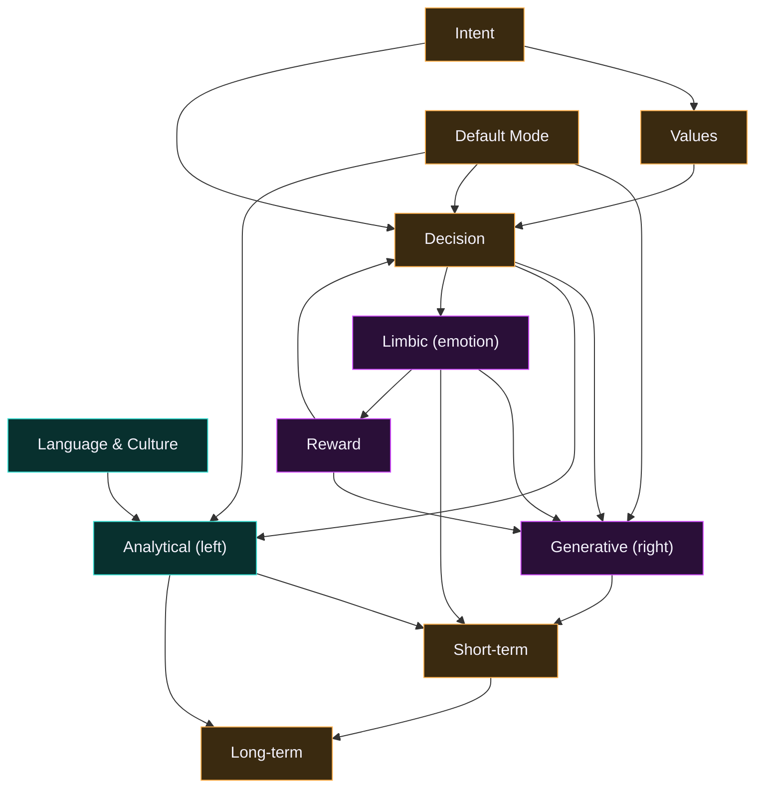

# 🧠 Brain wiring

> **Generated from code.** This diagram is rendered from `REGIONS` + `PATHWAYS` in
> [`lib/hermes/brainMap.ts`](../lib/hermes/brainMap.ts) — the single source of truth for
> the brain's anatomy — so it can never drift from the real wiring. Regenerate with
> `GEN_DOCS=1 npx vitest run wiring`.
>
> The brain metaphor is an [inspired workflow model](../brain/hemispheres.md), not
> biological. Each region is a real knowledge file or module; each nerve is a directed
> signal the pipeline fires along.

## The map

Left hemisphere is **analytical** (cyan), right is **generative** (magenta), center is
**core** decision/memory (amber) — the same palette the live Brain Scan uses.

## Regions

| id | Region | Hemisphere | Backing file |
|----|--------|-----------|--------------|
| `intent` | Intent | Core | `the brief` |
| `language` | Language & Culture | Analytical (L) | `lib/hermes/language.ts` |
| `values` | Values | Core | `brain/beliefs.json` |
| `generative` | Generative (right) | Generative (R) | `brain/personas.json` |
| `analytical` | Analytical (left) | Analytical (L) | `originality + scoring` |
| `decision` | Decision | Core | `the Writers-Room (process.ts)` |
| `limbic` | Limbic (emotion) | Generative (R) | `lib/hermes/emotion.ts` |
| `default-mode` | Default Mode | Core | `lib/hermes/defaultMode.ts` |
| `reward` | Reward | Generative (R) | `lib/hermes/reward.ts` |
| `short-term` | Short-term | Core | `working memory (this session)` |
| `long-term` | Long-term | Core | `brain/memory.json + the vault` |

19 directed pathways connect them. A song is generated by firing the
pipeline (`lib/hermes/pipeline.ts`); the nervous system lights each region as its agent
runs. See [`ARCHITECTURE.md`](../ARCHITECTURE.md) for the full module map.
