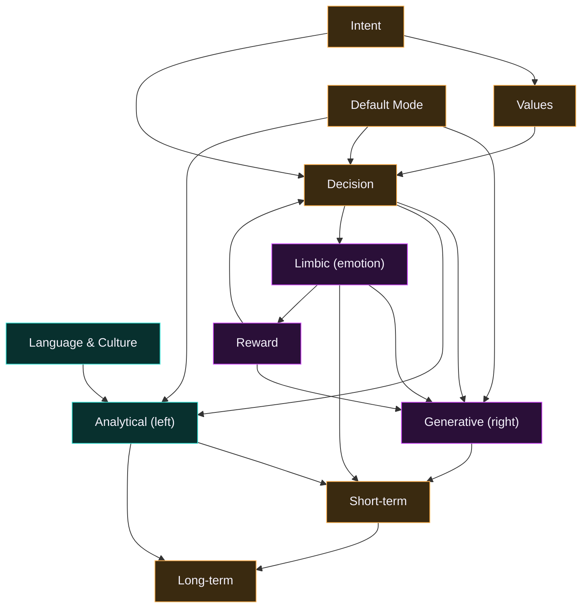

# 🧠 Brain wiring

> **Generated from code.** This diagram is rendered from `REGIONS` + `PATHWAYS` in
> [`lib/hermes/brainMap.ts`](../lib/hermes/brainMap.ts) — the single source of truth for
> the brain's anatomy — so it can never drift from the real wiring. Regenerate with
> `GEN_DOCS=1 npx vitest run wiring`.
>
> The brain metaphor is an [inspired workflow model](../brain/hemispheres.md), not
> biological. Each region is a real knowledge file or module; each nerve is a directed
> signal the pipeline fires along.

## The map

Left hemisphere is **analytical** (cyan), right is **generative** (magenta), center is
**core** decision/memory (amber) — the same palette the live Brain Scan uses.

## Regions

| id | Region | Hemisphere | Backing file |
|----|--------|-----------|--------------|
| `intent` | Intent | Core | `the brief` |
| `language` | Language & Culture | Analytical (L) | `lib/hermes/language.ts` |
| `values` | Values | Core | `brain/beliefs.json` |
| `generative` | Generative (right) | Generative (R) | `brain/personas.json` |
| `analytical` | Analytical (left) | Analytical (L) | `originality + scoring` |
| `decision` | Decision | Core | `the Writers-Room (process.ts)` |
| `limbic` | Limbic (emotion) | Generative (R) | `lib/hermes/emotion.ts` |
| `default-mode` | Default Mode | Core | `lib/hermes/defaultMode.ts` |
| `reward` | Reward | Generative (R) | `lib/hermes/reward.ts` |
| `short-term` | Short-term | Core | `working memory (this session)` |
| `long-term` | Long-term | Core | `brain/memory.json + the vault` |

19 directed pathways connect them. A song is generated by firing the
pipeline (`lib/hermes/pipeline.ts`); the nervous system lights each region as its agent
runs. See [`ARCHITECTURE.md`](../ARCHITECTURE.md) for the full module map.

## The Deep Brain Atlas — subsections

37 subregions nest inside the 11 hubs. The naming
language is human neuroanatomy; the ground truth is the codebase — every subsection's
backing column is a real module and function that runs. *(CLI lane)* marks the two
node-only modules that never ship to the browser.

### Intent (`intent`)

| Subsection | Role | Backing code |
|------------|------|--------------|
| dlPFC goal encoding | normalize the brief (tempo clamps, text caps) | `lib/hermes/pipeline.ts#normalizeInputs` |
| Conductor plan | route the job across the agent pipeline | `lib/hermes/agents.ts#getAgent` |

### Language & Culture (`language`)

| Subsection | Role | Backing code |
|------------|------|--------------|
| Wernicke's area | comprehend the artist's meaning → register + diction | `lib/hermes/language.ts#deriveLanguage` |
| Broca's area | produce guidance in the artist's own register | `lib/hermes/language.ts#languageCoaching` |
| Temporal lexicon | the vocabulary store (syllables, affect, imagery) | `lib/hermes/lexicon.ts#wordInfo` |
| Auditory cortex | rhyme + sound patterning (scheme, density, slant) | `lib/hermes/rhyme.ts#rhymeScheme` |
| Angular gyrus | bind imagery + metaphor to the theme | `lib/hermes/lexicon.ts#byImagery` |

### Values (`values`)

| Subsection | Role | Backing code |
|------------|------|--------------|
| vmPFC | integrate the belief system into every decision | `lib/hermes/beliefs.ts#beliefsFor` |
| Constitution | the belief store itself (truth-first, original-only) | `brain/beliefs.json` |

### Generative (right) (`generative`)

| Subsection | Role | Backing code |
|------------|------|--------------|
| Hook furnace (right STG) | forge hook candidates from angle + lexicon | `lib/hermes/pipeline.ts#runPipeline (hooksmith stage)` |
| Persona overlay | craft-DNA archetypes lend their moves | `lib/hermes/personas.ts#personaOverlay` |
| Voice mirror | how much of the song is already the artist's own voice | `lib/hermes/becomingYou.ts#voiceMirror` |
| Imagery studio | album-cover + visual direction from the concept | `lib/hermes/pipeline.ts#runPipeline (visual-director stage)` |

### Analytical (left) (`analytical`)

| Subsection | Role | Backing code |
|------------|------|--------------|
| Pattern auditor | fingerprint originality against the vault | `lib/hermes/originality.ts#checkOriginality` |
| Scorekeeper | the 7-category banger score /100 | `lib/hermes/scoring.ts#scoreSong` |
| Safety screen | famous-phrase check — original-only stays true | `lib/hermes/safety.ts#screenFamousPhrases` |
| Hook council | rank hooks across challenge · crave · confidence | `lib/hermes/council.ts#rankHooksByCouncil` |
| Semantic auditor *(CLI lane)* | meaning-level paraphrase check (CLI lane) | `lib/hermes/semanticOriginality.ts#mergeSemanticFlags` |

### Decision (`decision`)

| Subsection | Role | Backing code |
|------------|------|--------------|
| dlPFC writers-room | the step-by-step craft process, guided | `lib/hermes/process.ts#guideStep` |
| ACC | conflict monitoring — the second-thought critiques | `lib/hermes/cognition.ts#deliberate` |
| Corpus callosum | integrate fast instinct with slow deliberation | `lib/hermes/cognition.ts#selectHookByCognition` |
| Crossroads | the decision made social — community steering | `lib/hermes/crossroads.ts#decide` |

### Limbic (emotion) (`limbic`)

| Subsection | Role | Backing code |
|------------|------|--------------|
| Amygdala | the raw affect read (valence, intensity, contrast) | `lib/hermes/emotion.ts#deriveEmotion` |
| Affective arc | the feeling traced across sections | `lib/hermes/emotion.ts#emotionalArc` |
| Insula | felt clarity — does the song feel what it says? | `lib/hermes/emotion.ts#emotionClarity` |
| Affect–diction loop | emotion colors word choice from the lexicon | `lib/hermes/lexicon.ts#byAffect` |

### Default Mode (`default-mode`)

| Subsection | Role | Backing code |
|------------|------|--------------|
| mPFC drift | divergent angles surfaced before focus narrows | `lib/hermes/defaultMode.ts#divergentAngles` |
| Thermal signature | whole-brain temperature — where this artist runs hot | `lib/hermes/heat.ts#brainHeat` |

### Reward (`reward`)

| Subsection | Role | Backing code |
|------------|------|--------------|
| VTA spark | crave-ability — will the hook pull a replay? | `lib/hermes/reward.ts#craveScore` |
| OFC valuation | reward-guided next moves for this artist | `lib/hermes/recommend.ts#recommend` |

### Short-term (`short-term`)

| Subsection | Role | Backing code |
|------------|------|--------------|
| Working buffer | session RAM — holds, decays, consolidates | `lib/hermes/workingMemory.ts#createWorkingMemory` |

### Long-term (`long-term`)

| Subsection | Role | Backing code |
|------------|------|--------------|
| Hippocampus (episodic) | the vault — every song you kept | `lib/hermes/storage.ts#listSongs` |
| Semantic store | learned exclusions + preferences | `lib/hermes/memory.ts#allAvoidWords` |
| Consolidation | episodic → semantic: the artist profile | `lib/hermes/learn.ts#learnProfile` |
| Basal ganglia (habit) | taste learned from your edits | `lib/hermes/edits.ts#diffEdit` |
| Procedural memory | the recurring craft moves — the how, not the what | `lib/hermes/procedural.ts#proceduralMemory` |
| CA3 pattern completion *(CLI lane)* | vector recall of meaning-close past wins (node lane) | `lib/hermes/vectorRecall.ts#recallSimilarCraft` |
